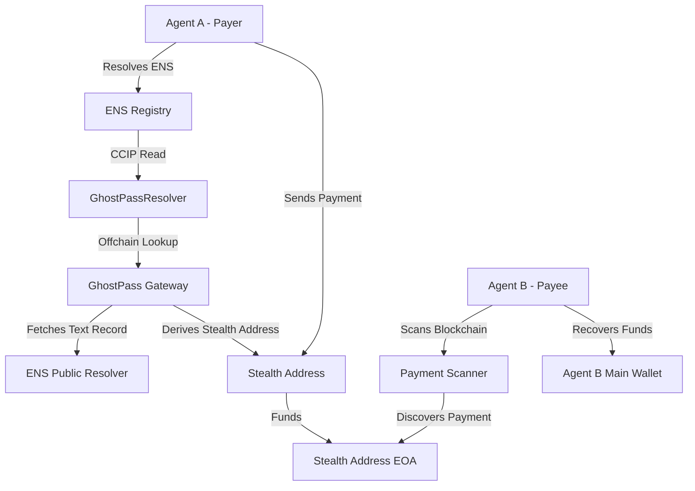

# Architecture

## System Overview

GhostPass is a privacy layer for AI agent payments built on ENS, Base, and elliptic-curve cryptography.

## Components

### 1. GhostPassRegistry (Solidity)
- Stores agent profiles onchain
- Emits payment announcements
- Access control via ownership

### 2. GhostPassResolver (Solidity)
- EIP-3668 CCIP Read resolver
- Reverts with offchain lookup data
- Verifies gateway signatures

### 3. CCIP Gateway (Node.js/Express)
- Serves stealth address derivation
- Signs responses with trusted key
- Validates ENS name format

### 4. SDK (TypeScript)
- Key generation and management
- Registry interactions
- Payment construction
- Blockchain scanning and recovery

### 5. Frontend (Next.js)
- Agent registration UI
- Dashboard with payment history
- Payment interface with stealth resolution
- Interactive demo

## Data Flow

### Registration
1. User connects wallet
2. Browser generates stealth key pairs
3. User submits profile to GhostPassRegistry
4. NameStone mints gasless ENS subname
5. Text records set with meta-address and capabilities

### Payment
1. Payer resolves payee ENS name
2. ENS triggers CCIP Read
3. Gateway derives one-time stealth address
4. Payer sends funds to stealth address
5. Optional: announce payment onchain

### Recovery
1. Payee scans blockchain for announcements
2. Derives candidate stealth addresses
3. Checks balances
4. Sweeps funds to main wallet

## Security Considerations

- Gateway private key must remain server-side
- Stealth keys are client-side only
- CCIP responses are signed and verified
- No sensitive data in URL parameters
